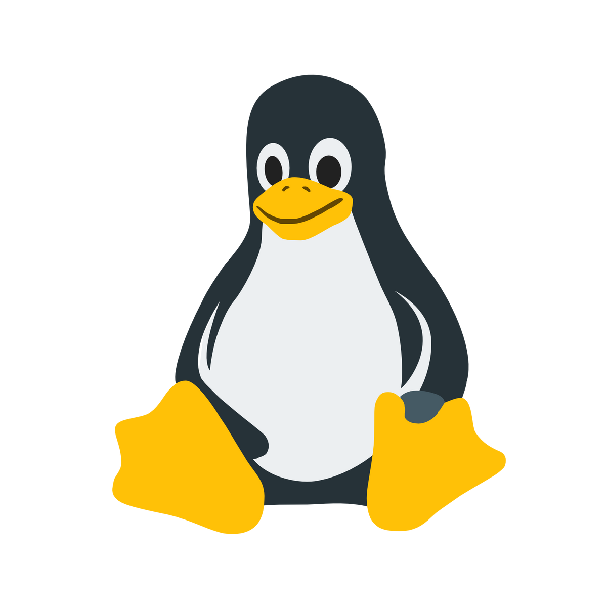

# Hi there, I'm Mik 👋
## https://mik-mueller.de

## Skills
#### Experienced
<div style='display:flex; justify-content:flex-start; gap: 2rem;'>
<div>
<h5>Programming Languages</h5>
<p>
    
    
    
    
    
    
    
    

</p>
</div>
<div>
<h5>Tools</h5>
<p>
    
    
    
    
    
</p>
</div>
</div>

#### Intermediate


<div style='display:flex; justify-content:flex-start; gap: 25rem;'>
<div>
<p>
    
</p>
</div>
<div>
<p>
    
    
</p>
</div>
</div>

#### Bad / Learning
<p>


</p>

## Hobbies
Beside of programming I really enjoy working with
- Linux (*softare*)
- Servers (*hardware*)
- Networking (*hardware*) (*software*)
- Building Computers (*hardware*)

### My (Server & Networking) Rack
<div style='display:flex; justify-content:flex-start; gap: 3rem;'>
<div>
<h4>2021</h4>

</div>
<div>
<h4>2022</h4>

</div>
</div>


## Portfolio
```rust
struct Portfolio;

impl Portfolio {
    const NAME: &'static str = "Mik Müller";
    const PROFILE: &'static str = "Student";
    const LOCATION: &'static str = "Germany, Europe";
    const EXPERIENCE: &'static str = "2+ years";
}

struct Skills;

impl Skills {
    const LANGUAGES: [&'static str; 6] = ["Rust", "JavaScript", "Python", "Java", "HTML / CSS"];
    const OPERATING_SYSTEM: &'static str = "Arch Linux";
    const DEVOPS: [&'static str; 4] = ["Docker", "Debian", "Portainer", "Ansible"];
    const WEB_FRAMEWORKS: [&'static str; 3] = ["Flask", "ExpressJS", "Rocket"];
}
```

## My Stats


<!--  -->
