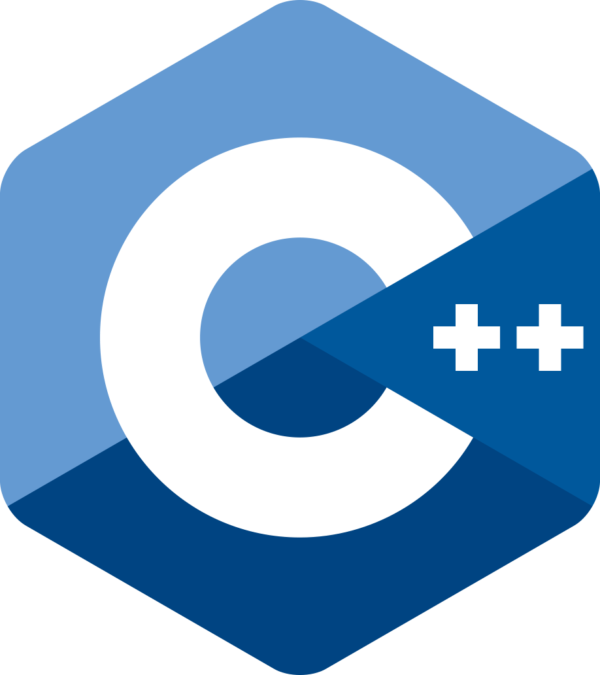

# Hi there, I'm Mik 👋

## https://mik-mueller.de

I am a student from Germany with 3+ years of programming experience.

## Skills

#### Experienced

    
    
    
    
    
     
    

#### Intermediate

        
    
    
    
    
    

#### Bad / Learning

### Tools

    
    
    
    
    

## Hobbies

<!-- Beside of programming I really enjoy working with

- Linux (_softare_)
- Servers (_hardware_)
- Networking (_hardware_) (_software_)
- Building Computers (_hardware_) -->

<!-- ### My (Server & Networking) Rack -->
<!-- 
 -->
<!-- <h4>2022</h4> -->
<!--  -->
<!-- 
 -->

## My Stats

<!--  -->

<!--  -->
